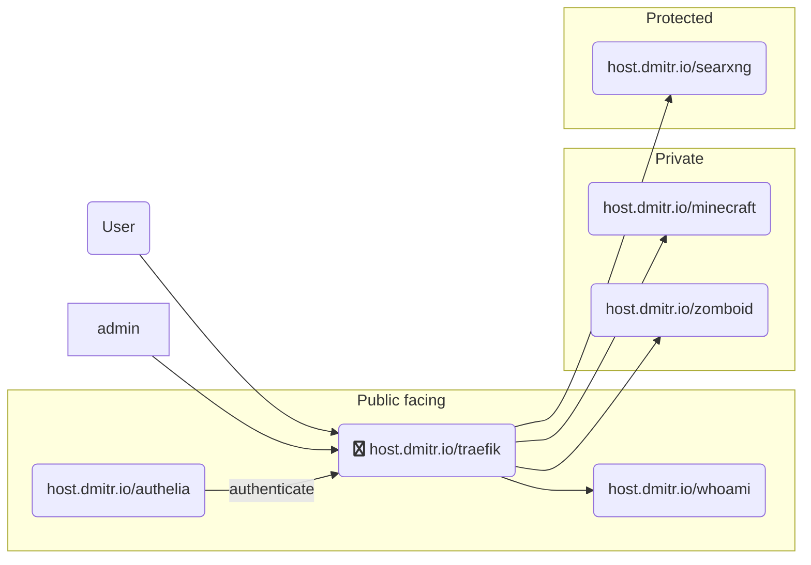

# host.dmitr.io - Infrastructure

## Core services

### Traefik

- [Traefik](https://host.dmitr.io/traefik) - Reverse proxy

### Authelia

- [Authelia](https://host.dmitr.io/authelia) - Authentication and authorization server

## Utilities

### SearXNG

- [host.dmitr.io/searxng](https://host.dmitr.io/searxng)

## Game Servers

### Minecraft

- [host.dmitr.io/minecraft](https://host.dmitr.io/minecraft)

### Project Zomboid

- [host.dmitr.io/zomboid](https://host.dmitr.io/zomboid)

## Deployment

### Mermaid Diagram:

